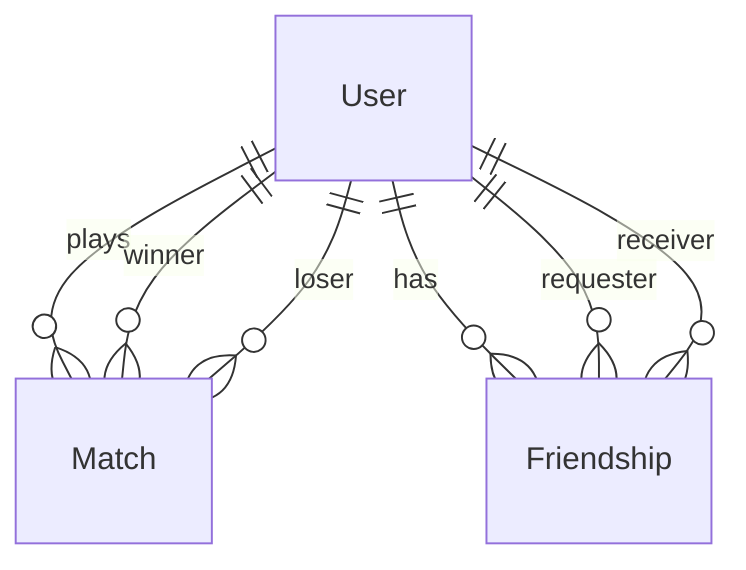

# データベース設計

---

## 1. 概念設計

## 2. テーブル定義

### Users

| カラム | 型 | 説明 |
|--------|-----|------|
| `user_id` | PK | ユーザーID |
| `username` | string | ユーザー名 |
| `icon_url` | string? | アイコンURL |
| `email` | string | メールアドレス |
| `password` | string? | パスワード（OAuth時は空） |
| `provider` | string? | 認証プロバイダー（42 / Google） |
| `total_matches` | int | 総対局数 |
| `wins` | int | 勝利数 |
| `losses` | int | 敗北数 |

### Matches

| カラム | 型 | 説明 |
|--------|-----|------|
| `match_id` | PK | 対戦ID |
| `winner_id` | FK → Users | 勝者 |
| `loser_id` | FK → Users | 敗者 |
| `started_at` | datetime | 開始時間 |
| `ended_at` | datetime | 終了時間 |

### Friendships

| カラム | 型 | 説明 |
|--------|-----|------|
| `id` | PK | フレンドシップID |
| `requester_id` | FK → Users | 申請者 |
| `receiver_id` | FK → Users | 受信者 |
| `status` | enum | `PENDING` / `ACCEPTED` |

## 3. Prisma スキーマ変更時のルール

- マイグレーション名は日本語でOK（例: `npx prisma migrate dev --name "フレンド機能追加"`）
- FK 制約は必ずつける
- `createdAt` / `updatedAt` は全テーブルに追加する
- enum は Prisma の `enum` を使う
