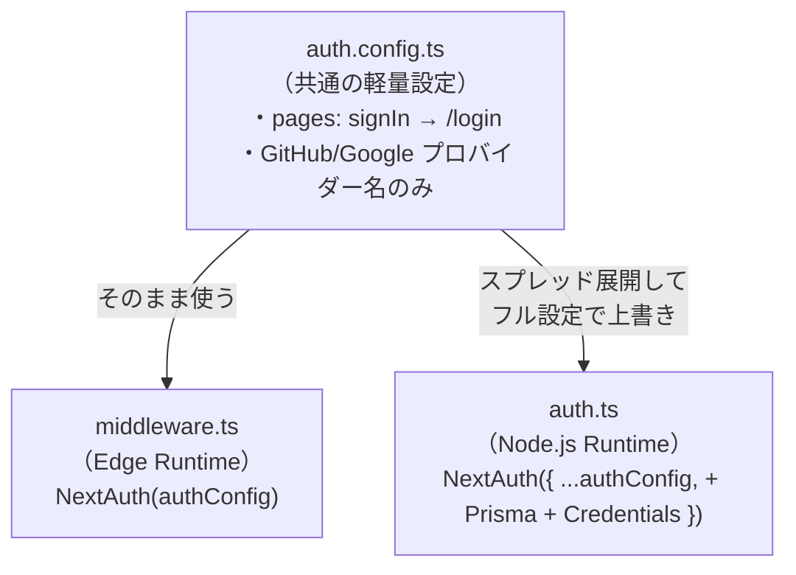
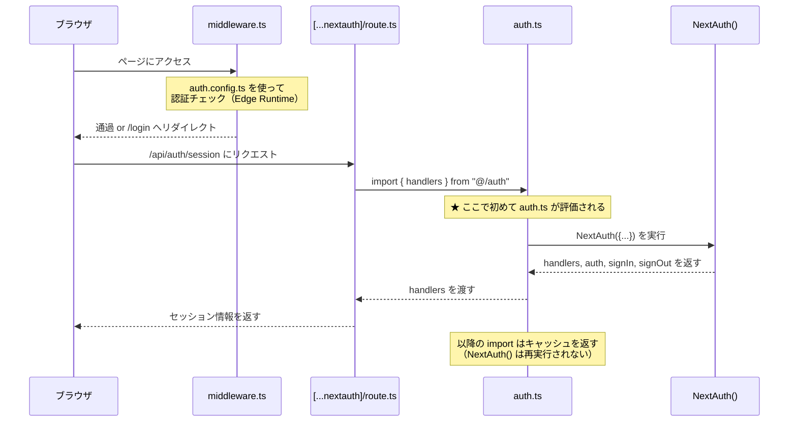

# Auth.js アーキテクチャまとめ

このプロジェクトでは **Auth.js（NextAuth.js v5 beta）** を使って認証を実現している。
本ドキュメントでは「**何が**」「**どこで**」「**なぜそうなっているか**」を整理する。

---

## 1. ファイル構成と役割

```
nextjs/
├── auth.config.ts          ← 共通設定（軽量版）
├── auth.ts                 ← 本体設定（フル版）
├── middleware.ts            ← 全リクエストの認証ガード
├── types/next-auth.d.ts     ← 型拡張
├── app/
│   ├── providers.tsx        ← SessionProvider（クライアント配信）
│   ├── api/auth/[...nextauth]/route.ts  ← Auth.jsのAPIエンドポイント
│   ├── login/page.tsx       ← signIn() でログイン実行
│   └── home/page.tsx        ← useSession(), signOut()
└── components/
    ├── Heartbeat.tsx        ← useSession()
    ├── MatchBoard.tsx       ← useSession()
    ├── AiMatchBoard.tsx     ← useSession()
    └── Chat/Chat.tsx        ← useSession()
```

---

## 2. 設定ファイルが2つある理由

Next.js には **2つの実行環境（Runtime）** がある：

| Runtime | 動く場所 | 特徴 | 制約 |
|---|---|---|---|
| **Edge Runtime** | CDNエッジサーバー | 超高速・軽量 | Node.js専用ライブラリ（Prisma, argon2等）が**使えない** |
| **Node.js Runtime** | 通常のサーバー | フル機能 | 制約なし |

`middleware.ts` は **Edge Runtime** で動くため、Prismaを含む `auth.ts` を直接 import できない。
そこで設定を2つに分離している：



### auth.config.ts（軽量版）

```typescript
// Edge Runtime でも安全に動く設定だけ
export default {
  providers: [ GitHub(...), Google(...) ],  // 名前だけ（認証処理はしない）
  callbacks: { jwt(...), session(...) },
  pages: { signIn: "/login" },              // ← これを共通化したい
} satisfies NextAuthConfig;
```

### auth.ts（フル版）

```typescript
// Node.js Runtime 用のフル設定
export const { handlers, auth, signIn, signOut } = NextAuth({
  adapter: PrismaAdapter(prisma),     // ← Edge では動かない
  ...authConfig,                       // ← 共通設定を展開
  providers: [
    GitHub(...),
    Google(...),
    Credentials({ authorize(...) }),   // ← argon2 を使うので Edge では動かない
  ],
  callbacks: { jwt(...), session(...) }, // ← authConfig の callbacks を上書き
});
```

---

## 3. 初回呼び出し（インスタンス化）の仕組み

### 核心：`NextAuth()` はモジュールのトップレベルで呼ばれる

```typescript
// auth.ts の11行目（関数の中ではなく、ファイルの最上位）
export const { handlers, auth, signIn, signOut } = NextAuth({...});
```

C言語で例えると：
```c
// グローバル変数の初期化式 ≒ モジュールトップレベルの実行
static AuthInstance* g_auth = create_auth(...);
```

### いつ実行されるか？

Node.js のモジュールシステムのルール：

> **モジュールは最初に `import` された瞬間に、トップレベルのコードが1回だけ実行される。**  
> **以降の `import` はキャッシュされた結果が返される（シングルトン）。**



---

## 4. 全使用箇所マップ

Auth.js は **4つのレイヤー** にわたって使われている：

### レイヤー①：設定・初期化

| ファイル | 役割 |
|---|---|
| `auth.config.ts` | 共通の軽量設定（ページ定義など） |
| `auth.ts` | Auth.js 本体の初期化。`handlers`, `auth`, `signIn`, `signOut` をエクスポート |
| `types/next-auth.d.ts` | Session と JWT の TypeScript 型を拡張（`id` フィールド追加） |

### レイヤー②：認証ガード（サーバーサイド）

| ファイル | 何をしているか |
|---|---|
| `middleware.ts` | 全リクエストに対し認証チェック。未ログインなら `/login` へリダイレクト |
| `api/auth/[...nextauth]/route.ts` | Auth.js の HTTP エンドポイント（`/api/auth/*`）を公開 |

### レイヤー③：セッション配信（クライアント基盤）

| ファイル | 何をしているか |
|---|---|
| `providers.tsx` | `SessionProvider` でアプリ全体をラップ → 全コンポーネントで `useSession()` が使えるようになる |

### レイヤー④：各ページ・コンポーネントでの利用

| ファイル | 使う関数 | 目的 |
|---|---|---|
| `login/page.tsx` | `signIn()` | ログイン実行 |
| `home/page.tsx` | `useSession()`, `signOut()` | ユーザー表示・ログアウト |
| `profile/edit/page.tsx` | `useSession()` | プロフィール情報取得・更新 |
| `room/[roomId]/page.tsx` | `useSession()` | 対戦部屋でのユーザー識別 |
| `Heartbeat.tsx` | `useSession()` | オンライン状態の定期送信 |
| `MatchBoard.tsx` | `useSession()` | 対戦中のユーザー識別 |
| `AiMatchBoard.tsx` | `useSession()` | AI対戦中のユーザー識別 |
| `Chat/Chat.tsx` | `useSession()` | チャットの送信者識別 |

サーバーサイド API ルートでの利用：

| ファイル | 使う関数 | 目的 |
|---|---|---|
| `api/me/route.ts` | `auth()` | 自分のユーザー情報取得 |
| `api/profile/route.ts` | `auth()` | プロフィール更新時の認証 |
| `api/profile/avatar/route.ts` | `auth()` | アバター更新時の認証 |
| `api/friends/route.ts` | `auth()` | フレンド一覧取得時の認証 |
| `api/friends/[id]/route.ts` | `auth()` | フレンド追加/削除時の認証 |
| `api/heartbeat/route.ts` | `auth()` | ハートビート送信時の認証 |
| `api/result/route.ts` | `auth()` | 対戦結果保存時の認証 |

---

## 5. Auth.js から得ている情報の種類

### Auth.js が管理する2つのデータ構造

Auth.js の内部には **JWT（トークン）** と **Session（セッション）** という2つのデータ構造がある。
JWT はサーバー内部で使われ、Session はそこから作られてフロントエンドに渡される。

```
JWT（サーバー内部）           Session（フロント・APIに渡る）
┌──────────────────┐        ┌──────────────────────┐
│ id    : string   │───→    │ user.id    : string   │
│ name  : string   │───→    │ user.name  : string   │
│ picture: string  │───→    │ user.image : string   │
│ email : string   │        │ user.email : string   │
│ (その他内部情報)  │        │ expires    : string   │
└──────────────────┘        └──────────────────────┘
     auth.ts の                  auth.ts の
     jwt() コールバック           session() コールバック
     で書き込み                   で JWT → Session にコピー
```

### 型拡張（types/next-auth.d.ts）

Auth.js のデフォルトの Session には `id` フィールドがない。
このプロジェクトでは TypeScript の **Declaration Merging** で `id` を追加している：

```typescript
// デフォルトの Session.user → { name, email, image }
// ↓ 型拡張後
// Session.user → { id, name, email, image }  ← id が追加された

declare module "next-auth" {
    interface Session {
        user: { id: string } & DefaultSession["user"]
    }
}
```

### 各ファイルで実際に使っているフィールド

#### クライアントサイド（`useSession()` → `session.user.*`）

| ファイル | `.id` | `.name` | `.image` | `.email` | 用途 |
|---|:---:|:---:|:---:|:---:|---|
| `home/page.tsx` | ✓ | ✓ | ✓ | - | ユーザー情報の画面表示 |
| `login/page.tsx` | - | - | - | - | `signIn()` のみ使用（セッション参照なし） |
| `profile/edit/page.tsx` | - | ✓ | ✓ | - | プロフィール編集の初期値表示 |
| `room/[roomId]/page.tsx` | ✓ | - | - | - | WebSocket で自分のIDを送信 |
| `MatchBoard.tsx` | ✓ | - | - | - | 対戦中の自分の駒を判別 |
| `AiMatchBoard.tsx` | ✓ | - | - | - | AI対戦で自分を識別 |
| `Chat/Chat.tsx` | ✓ | - | - | - | チャットメッセージの送信者識別 |
| `Heartbeat.tsx` | ✓ | - | - | - | オンライン状態のハートビート送信 |

#### サーバーサイド API（`auth()` → `session.user.*`）

| ファイル | `.id` | `.name` | `.image` | `.email` | 用途 |
|---|:---:|:---:|:---:|:---:|---|
| `api/me/route.ts` | ✓ | - | - | - | DBから自分の情報を取得する際のキー |
| `api/profile/route.ts` | ✓ | - | - | - | プロフィール更新対象の特定 |
| `api/profile/avatar/route.ts` | ✓ | - | - | - | アバターファイル名・DB更新のキー |
| `api/friends/route.ts` | ✓ | - | - | - | フレンド一覧取得のキー |
| `api/friends/[id]/route.ts` | ✓ | - | - | - | フレンド追加/削除の操作者特定 |
| `api/heartbeat/route.ts` | ✓ | - | - | - | lastSeen 更新対象の特定 |
| `api/result/route.ts` | ✓ | - | - | - | 対戦結果をDBに保存する際のキー |

### まとめ：最も重要なのは `user.id`

上の表からわかるとおり、**ほぼ全てのファイルが `session.user.id` を使っている**。
これが Auth.js から得ている最も重要な情報で、「**今リクエストしているのは誰なのか**」を判別するための鍵になっている。

- `user.id` → **全ファイルで使用** — 「誰か」を識別するDB主キー
- `user.name` → 画面表示用（ホーム画面、プロフィール編集）
- `user.image` → アバター画像の表示（ホーム画面、プロフィール編集）
- `user.email` → このプロジェクトでは直接参照していない（Auth.js 内部で OAuth 連携時に使用）

---

## 6. データの流れ（全体像）

```
① ユーザーがログインフォームで送信
       ↓
② auth.ts の Credentials/GitHub/Google プロバイダーが認証処理
       ↓
③ JWT コールバック → トークンに id, name, image を書き込み
       ↓
④ セッション Cookie がブラウザに保存される
       ↓
⑤ providers.tsx の SessionProvider がセッションをReactツリー全体に配信
       ↓
⑥ 各コンポーネントが useSession() でセッションデータを取得
       ↓
⑦ API呼び出し時は Cookie が自動送信 → サーバー側で auth() が検証
```

---

## 7. 環境変数

Auth.js が必要とする環境変数（`.env` に定義）：

| 変数名 | 用途 |
|---|---|
| `AUTH_SECRET` | JWT署名用の秘密鍵（必須） |
| `AUTH_GITHUB_ID` | GitHub OAuth アプリの Client ID |
| `AUTH_GITHUB_SECRET` | GitHub OAuth アプリの Client Secret |
| `AUTH_GOOGLE_ID` | Google OAuth の Client ID |
| `AUTH_GOOGLE_SECRET` | Google OAuth の Client Secret |

---

## 8. 一言まとめ

- **`auth.config.ts`** = Edge でも動く共通設定
- **`auth.ts`** = フル機能の認証エンジン本体
- **`middleware.ts`** = 全ページの門番（軽量版を使う）
- **`providers.tsx`** = クライアントへのセッション配信
- **`[...nextauth]/route.ts`** = Auth.js の HTTP API 公開
- **各コンポーネント** = `useSession()` でセッションを消費
